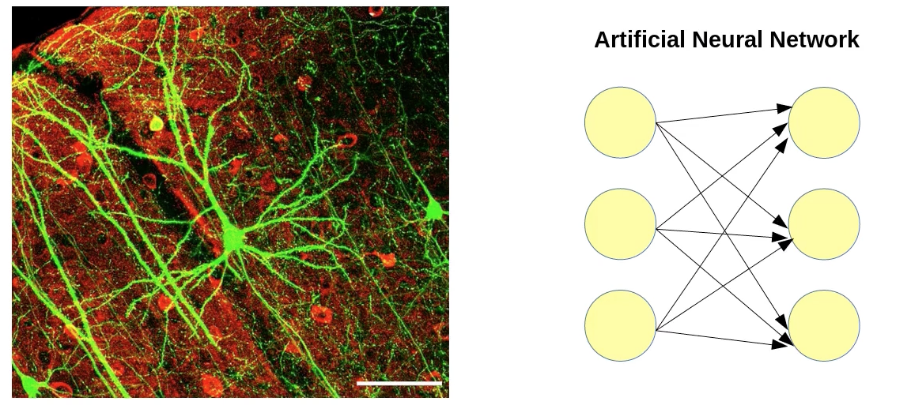

# TensorFlow in the Batcave
[Tensorflow course](https://code.tutsplus.com/courses/learn-machine-learning-with-google-tensorflow/lessons/setting-up-tensorflow)

## Setup
The first step is to install a virtual environment on your machine

```Python
pip install virtualenv
virtualenv my_tf_environment
cd my_tf_environment
source bin/activate

# Now we can install Tensorflow
pip install tensorflow
# save and restore tensorflow neural networks
pip install h5py
# easier to read and manage data
pip install pandas
```

## Neural networks


